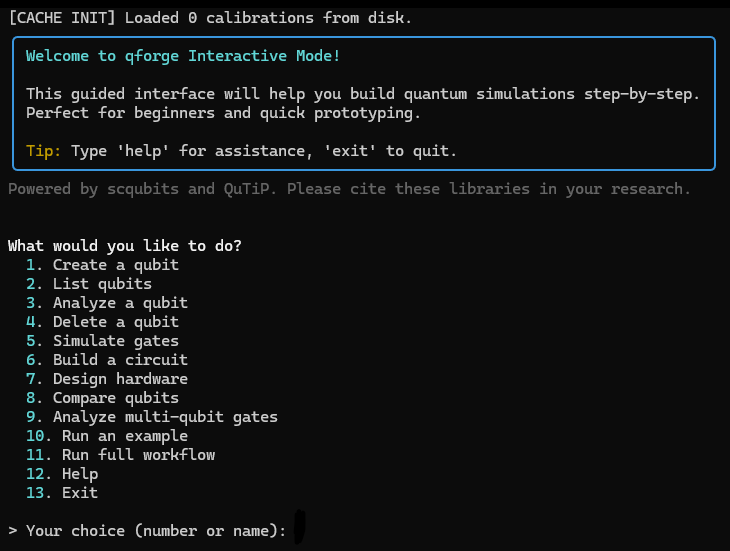

==========
Interfaces
==========

qforge has four front ends over the same engines: an interactive terminal wizard, a
desktop GUI, a scriptable CLI, and the Python API. None of them owns any physics.
Every one of them delegates to the engines described in the rest of this
documentation, so anything you can do in the wizard you can also do in a script.

Interactive mode
================

.. code-block:: bash

    $ qforge --interactive

The wizard is built on prompt-toolkit and Rich. Move with the arrow keys and enter,
or start typing an option's name to filter. ``q``, ``Esc`` or ``Ctrl-C`` backs out
of a menu. Tab completes qubit names, file paths and coupling choices.

The menu
--------

**Qubits.** Create a qubit from a type and a preset, with the wizard prompting for
whichever parameters that model actually needs. List, analyze (spectrum,
anharmonicity, coherence), compare several side by side, or delete one along with its
cached calibrations.

**Gates and circuits.** Simulate a one or two qubit gate and watch the populations
evolve, with the coupling type, pulse duration and noise model all adjustable.
"Analyze multi-qubit gates" benchmarks CNOT or CZ across coupling architectures and
strengths and prints a comparison table.

**Workflows.** Run a full workflow: pick your qubits, define the topology, point at
an OpenQASM file, and choose whether to run it bare or encoded. Error correction
offers the repetition, Steane and Shor codes, and warns you before it builds a state
vector large enough to hurt.

**Device design.** Start from one of nine templates or load a netlist you wrote. Then
analyze it, show its schematic, sweep a parameter, or export the netlist back out.
The format reference is one menu item away.

**Learn.** Run any of the bundled example scripts, or open the help page.

Graphical interface
===================

.. code-block:: bash

    $ qforge --gui

The GUI is a tkinter application covering the same workflows as the wizard, with a
dark theme, a sidebar of actions and a console pane that renders Rich tables and
plotext charts faithfully, box drawing characters and all. Pickers are searchable, so
selecting a qubit or a template is click or type rather than remembering a name.

It needs a desktop session. Everything else in qforge runs headless.

Command line
============

For scripts, batch runs and CI, every workflow has a command. See :doc:`cli` for the
full reference.

.. code-block:: bash

    $ qforge qubit create --type transmon --name Q1 --EJ 15 --EC 0.3
    $ qforge qubit analyze --name Q1 --plot --coherence
    $ qforge gate simulate --qubit Q1 --gate X --duration 40 --noise realistic

Python API
==========

The engines are the real interface. Import them and go:

.. code-block:: python

    from qforge.core.qubit_engine import QubitEngine
    from qforge.core.gate_engine import GateEngine
    from qforge.core.workflow_engine import PhysicalWorkflowEngine
    from qforge.core.error_correction_engine import ErrorCorrectionEngine
    from qforge.core.device_engine import DeviceEngine

Simulation methods return structured results rather than plotting, so they compose
into your own analysis. See :doc:`quickstart` to get going and :doc:`api` for the
generated reference.

Try it in a browser
===================

Below is a working sandbox with qforge and its numerical backends already installed,
running on MyBinder. Nothing to install locally.

.. note::

   Binder provisions a container on demand, so the terminal takes a moment to appear.
   Do not close or refresh the page while it loads.

1. Wait for Binder to finish. A terminal appears and boots straight into
   ``qforge --interactive``.
2. Work through the menus. Arrow keys and enter, or type an option's name.
3. Tab completes qubit names and coupling choices.
4. Type ``exit`` or ``quit``, or press ``Ctrl-C``, to leave.

.. raw:: html

   

       <iframe src="https://mybinder.org/v2/gh/Ingenio17/qforge/master?urlpath=terminals/1"
               style="position: absolute; top: 0; left: 0; width: 100%; height: 100%; border: 0; background: #1a1a1a;"
               allowfullscreen>
       </iframe>
   

